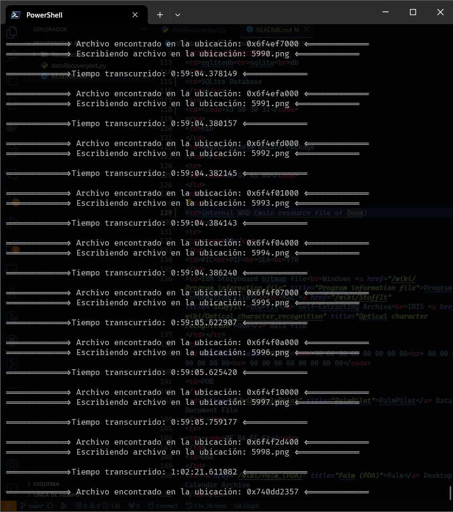

<div align="center">
    

</br>
</br>

[](https://github.com/Marioalf2002/Mouse-Data-Recovery)
[](https://github.com/Marioalf2002/Mouse-Data-Recovery)

<!-- ## Contribuidores / Contributors

¡Gracias a las siguientes personas por sus contribuciones a este proyecto!<br>
Thanks to the following people for their contributions to this project!

[](https://github.com/Marioalf2002/Data_Recovery/graphs/contributors) -->

</div>
</br>

## Contribuciones / Contributions

- Aquellos que gusten contribuir con mejoras al codigo podran hacerlo mediante un pull request, se pide que todo aquellos cambios que se realicen sean documentados en el archivo [Changes](changes.md).

  Si se va a modificar utilizando IA, se espera que el creador tenga conocimiento y comprensión del código proporcionado por la IA, evitando así que se realicen cambios innecesarios o que puedan afectar el funcionamiento del programa.

- Those who like to contribute with improvements to the code may do so through a pull request; it is requested that all changes made be documented in the file [Changes](changes.md).

  If it is to be modified using AI, the creator is expected to have knowledge and understanding of the code provided by the AI, thus preventing unnecessary changes from being made or changes that may affect the operation of the program.

</br>

# Tabla de Contenido

- [ESPAÑOL](#español)
  - [Mouse Data Recovery](#mouse-data-recovery-es)
  - [Tamaño Buffer](#tamaño-buffer)
  - [Pruebas](#pruebas)
  - [Firmas Hexadecimales](#firmas-hexadecimales)
- [ENGLISH](#english)
  - [Mouse Data Recovery](#mouse-data-recovery-en)
  - [Buffer Size](#buffer-size)
  - [Testing](#testing)
  - [Hexadecimal Signatures](#hexadecimal-signatures)
- [Copyrigth and License](#copyrigth-and-License)
- [Tipos de Archivos y Firmas Hexadecimal / File Types and Hexadecimal Signatures](#tipos-de-archivos-y-firmas-hexadecimal---file-types-and-hexadecimal-signatures)

# ESPAÑOL

## Mouse Data Recovery ES

Este código proporciona una funcionalidad para recuperar archivos específicos de un disco duro o memoria USB, utilizando firmas hexadecimales para identificar tipos de archivos. Aquí está la explicación detallada:

Importación de módulos: El código comienza importando los módulos necesarios:

- **OS:** Permite interactuar con el sistema operativo.
- **Time:** Proporciona funciones para trabajar con fechas y horas.
- **Timedelta:** Una clase para representar intervalos de tiempo.
- **Hashlib:** Permite calcular resúmenes de mensajes y códigos hash.
- **Variables globales:** Se define una variable size que determina el tamaño del bloque de lectura. Esto puede ajustarse dependiendo de la capacidad del disco duro o memoria USB.

**Función de formato de tiempo:** strfdelta es una función auxiliar que formatea un objeto timedelta en una cadena legible.

**Función de generación de hash de archivo:** generate_file_hash calcula el hash MD5 de un archivo dado. Utiliza el módulo hashlib para generar el hash del contenido del archivo en formato hexadecimal.

**Función de recuperación de archivos:** recover_files es la función principal que realiza la recuperación de archivos. Recibe como entrada la ruta del disco duro o memoria USB (drive), la firma hexadecimal del tipo de archivo a buscar (signature), el tipo de archivo (tipo), y el directorio de salida para los archivos recuperados (output_dir).

Lee el disco duro o memoria USB en bloques de tamaño size.
Busca la firma hexadecimal en cada bloque leído.
Cuando encuentra la firma, recupera el archivo asociado.
Escribe el archivo recuperado en el directorio de salida.

**Lista de tipos de archivo y firmas hexadecimales:** main define una lista de tipos de archivo junto con sus respectivas firmas hexadecimales. Esta lista se utiliza para iterar sobre cada tipo de archivo y recuperarlos del disco duro o memoria USB.

## Tamaño Buffer

La cantidad de bytes a leer depende de la **Capacidad** del **Disco Duro** o **Memoria USB**. También depende de la **Cantidad** de **RAM** que tenga el sistema operativo.

- **Gama Baja:** se recomienda leer entre 512 bytes y 2048 bytes.
- **Gama Media:** se recomienda leer entre 2048 bytes y 8192 bytes.
- **Gama Alta:** se recomienda leer entre 8192 bytes y 65536 bytes o más.

En este caso, el código establece la variable de tamaño en 16777216, que corresponde a un tamaño de bloque de **16 megabytes**. Este valor se puede ajustar en función de los requisitos específicos de la aplicación o sistema.

## Pruebas

Pruebas realizadas en un **Acer Nitro 5 AN515-58** con las siguientes especificaciones:

- **Procesador:** i5-12500H 3.10 GHz
- **Almacenamiento:** M.2 Nvme 500GB
- **Tarjeta gráfica:** RTX3050
- **Memoria RAM:** 32GB

Los resultados obtenidos fueron satisfactorios al emplear un tamaño de bloque de **16 megabytes**, logrando así la recuperación de **80GB** de un **Disco Duro Externo**. La mayor parte de los archivos fueron recuperados en su totalidad, sin pérdida de información.

**IMPORTANTE:** Es crucial tener en cuenta que el estado de los archivos puede variar dependiendo del tiempo que llevan eliminados.



## Firmas Hexadecimales

A continuación se muestra una lista de tipos de archivo admitidos junto con sus respectivas firmas hexadecimales. Estas firmas se utilizan para identificar los tipos de archivos durante el proceso de recuperación. Puedes agregar o modificar esta lista según tus necesidades:

Puedes habilitar o deshabilitar tipos de archivo adicionales editando esta lista. Asegúrate de que las firmas hexadecimales sean correctas para evitar problemas durante el proceso de recuperación.

**IMPORTANTE:** No repita tipos de archivos en la lista. Asegúrese de que las firmas hexadecimales sean correctas para evitar problemas durante el proceso de recuperación.

**Ejemplo:**

```
tipos_archivo = [
        ("JPEG", "FFD8FFE0"),  # Archivo de imagen JPEG
        ("PNG", "89504E470D0A1A0A"),  # Archivo de imagen PNG
        ("AI", "255044462D312E"),  # Archivo Adobe Illustrator
        ("EPS", "252150532D41646F6265"),  # Archivo Encapsulated PostScript
        ("INDD", "06054B50"),  # Archivo Adobe InDesign
        ("PSD", "38425053"),  # Archivo Adobe Photoshop
        ("PDF", "25504446"),  # Archivo Adobe PDF
        ("BMP", "424D"),  # Archivo de imagen BMP
        ("TIFF", "49492A00"),  # Archivo de imagen TIFF (Intel)
        ("TIFF", "4D4D002A"),  # Archivo de imagen TIFF (Motorola)
        ("FLA", "464C5601"),  # Archivo Adobe Flash FLA
        ("SWF", "435753"),  # Archivo Adobe Flash SWF
        ("F4V", "464432"),  # Archivo de video Adobe Flash F4V
        ("GIF", "47494638"),  # Archivo de imagen GIF
        ("MP3", "FFF8"),  # Archivo de audio MP3
        ("MP4", "66747970"),  # Archivo de video MP4
        ("JPEG2000", "0000000C6A502020"),  # Archivo de imagen JPEG2000
        ("AVI", "52494646"),  # Archivo de video AVI
        ("WAV", "52494646"),  # Archivo de audio WAV
        ("FLAC", "664C6143"),  # Archivo de audio FLAC
        # ("MOV", "6D6F6F76"),  # Archivo de video QuickTime MOV
        # ("WMV", "3026B275"),  # Archivo de video Windows Media WMV
        # ("EXE", "4D5A"),  # Archivo ejecutable EXE
        # ("AIFF", "464F524D00"),  # Archivo de audio AIFF
        # ("ZIP", "504B0304"),  # Archivo comprimido ZIP
        # ("RAR", "526172211A0700"),  # Archivo comprimido RAR
        # ("7Z", "377ABCAF271C"),  # Archivo comprimido 7Z
        # ("TAR", "7573746172"),  # Archivo comprimido TAR
        # ("GZ", "1F8B0800"),  # Archivo comprimido GZ
        # ("XZ", "FD377A585A00"),  # Archivo comprimido XZ
        # ("TAR.GZ", "1F8B080000000000"),  # Archivo comprimido TAR.GZ
        # ("TAR.XZ", "FD377A585A00"),  # Archivo comprimido TAR.XZ
        # ("TAR.BZ2", "425A68"),  # Archivo comprimido TAR.BZ2
        # ("DOCX", "504B0304"),  # Archivo de documento Microsoft Word DOCX
        # ("XLSX", "504B0304"),  # Archivo de documento Microsoft Excel XLSX
        # ("PPTX", "504B0304"),  # Archivo de documento Microsoft PowerPoint PPTX
        # ("ODT", "504B0304"),  # Archivo de documento OpenDocument ODT
        # ("ODS", "504B0304"),  # Archivo de documento OpenDocument ODS
        # ("ODP", "504B0304"),  # Archivo de documento OpenDocument ODP
    ]
```

# ENGLISH

## Mouse Data Recovery EN

This code provides functionality to recover specific files from a hard drive or USB stick, using hexadecimal signatures to identify file types. Here is the detailed explanation:

Importing modules: The code begins by importing the necessary modules:

- **OS:** Allows you to interact with the operating system.
- **Time:** Provides functions for working with dates and times.
- **Timedelta:** A class to represent time intervals.
- **Hashlib:** Allows you to calculate message digests and hash codes.
- **Global variables:** A size variable is defined that determines the size of the reading block. This can be adjusted depending on the capacity of the hard drive or USB stick.

**Time Format Function:** strfdelta is a helper function that formats a timedelta object into a readable string.

**Generate file hash function:** generate_file_hash calculates the MD5 hash of a given file. It uses the hashlib module to hash the file contents in hexadecimal format.

**File Recovery Function:** recover_files is the main function that performs file recovery. It receives as input the path of the hard drive or USB memory (drive), the hexadecimal signature of the type of file to be searched (signature), the type of file (type), and the output directory for the recovered files (output_dir).

Reads the hard drive or USB memory in blocks of size.
Looks for the hexadecimal signature in each block read.
When it finds the signature, it retrieves the associated file.
Write the recovered file to the output directory.

**List of file types and hexadecimal signatures:** main defines a list of file types along with their respective hexadecimal signatures. This list is used to iterate over each file type and recover them from the hard drive or USB stick.

## Buffer Size

The number of bytes to read depends on the **Capacity** of the **hard drive** or **USB memory**. It also depends on the **Amount** of **RAM** the operating system has.

- **Low range:** it is recommended to read between 512 bytes and 2048 bytes.
- **Medium range:**,it is recommended to read between 2048 bytes and 8192 bytes.
- **High range:** it is recommended to read between 8192 bytes and 65536 bytes or more.

In this case, the code sets the size variable to 16777216, which corresponds to a block size of **16 megabytes**. This value can be adjusted based on specific application or system requirements.

## Testing

Tests carried out on an **Acer Nitro 5 AN515-58** with the following specifications:

- **Processor:** i5-12500H 3.10 GHz
- **Storage:** M.2 Nvme 500GB
- **Graphics card:** RTX3050
- **RAM memory:** 32GB

The results obtained were satisfactory when using a block size of **16 megabytes**, thus achieving the recovery of **80GB** of an **External Hard Drive**. Most of the files were recovered in their entirety, without loss of information.

**IMPORTANT:** It is crucial to keep in mind that the status of the files may vary depending on how long they have been deleted.

</br>


## Hexadecimal Signatures

Below is a list of supported file types along with their respective hexadecimal signatures. These signatures are used to identify file types during the recovery process. You can add or modify this list according to your needs:

You can enable or disable additional file types by editing this list. Make sure the hexadecimal signatures are correct to avoid problems during the recovery process.

**IMPORTANT:** Do not repeat file types in the list. Make sure the hexadecimal signatures are correct to avoid problems during the recovery process.

**Example:**

```
tipos_archivo = [
        ("JPEG", "FFD8FFE0"),  # File JPEG
        ("PNG", "89504E470D0A1A0A"),  # File PNG
        ("AI", "255044462D312E"),  # File Adobe Illustrator
        ("EPS", "252150532D41646F6265"),  # File Encapsulated PostScript
        ("INDD", "06054B50"),  # File Adobe InDesign
        ("PSD", "38425053"),  # File Adobe Photoshop
        ("PDF", "25504446"),  # File Adobe PDF
        ("BMP", "424D"),  # File imagen BMP
        ("TIFF", "49492A00"),  # File TIFF (Intel)
        ("TIFF", "4D4D002A"),  # File TIFF (Motorola)
        ("FLA", "464C5601"),  # File Adobe Flash FLA
        ("SWF", "435753"),  # File Adobe Flash SWF
        ("F4V", "464432"),  # File de video Adobe Flash F4V
        ("GIF", "47494638"),  # File GIF
        ("MP3", "FFF8"),  # File MP3
        ("MP4", "66747970"),  # File MP4
        ("JPEG2000", "0000000C6A502020"),  # File JPEG2000
        ("AVI", "52494646"),  # File AVI
        ("WAV", "52494646"),  # File WAV
        ("FLAC", "664C6143"),  # File FLAC
        # ("MOV", "6D6F6F76"),  # File QuickTime MOV
        # ("WMV", "3026B275"),  # File Windows Media WMV
        # ("EXE", "4D5A"),  # File EXE
        # ("AIFF", "464F524D00"),  # File AIFF
        # ("ZIP", "504B0304"),  # File ZIP
        # ("RAR", "526172211A0700"),  # File RAR
        # ("7Z", "377ABCAF271C"),  # File 7Z
        # ("TAR", "7573746172"),  # File TAR
        # ("GZ", "1F8B0800"),  # File GZ
        # ("XZ", "FD377A585A00"),  # File XZ
        # ("TAR.GZ", "1F8B080000000000"),  # File TAR.GZ
        # ("TAR.XZ", "FD377A585A00"),  # File TAR.XZ
        # ("TAR.BZ2", "425A68"),  # File TAR.BZ2
        # ("DOCX", "504B0304"),  # File Microsoft Word DOCX
        # ("XLSX", "504B0304"),  # File Microsoft Excel XLSX
        # ("PPTX", "504B0304"),  # File Microsoft PowerPoint PPTX
        # ("ODT", "504B0304"),  # File OpenDocument ODT
        # ("ODS", "504B0304"),  # File OpenDocument ODS
        # ("ODP", "504B0304"),  # File OpenDocument ODP
    ]
```

</br>

## Copyrigth and License

Copyright © 2024 - [Mario Hernandez](https://github.com/Marioalf2002)

This code is licensed under the [GNU General Public License v3.0](LICENSE.md).</br>
Este código tiene licencia bajo la [GNU General Public License v3.0](LICENSE.md).

## Tipos de Archivos y Firmas Hexadecimal - File Types and Hexadecimal Signatures

Es posible que haya otros tipos de archivos cuyas firmas hexadecimales no estén incluidas en la tabla.

There may be other file types whose hexadecimal signatures are not included in the table.

</br>
<table>
<thead><tr>
<th>Hex</a> signature
</th>
<th>Extension
</th>
<th>Description
</th></tr></thead><tbody>
<tr>
<td><code>23 21</code>
</td>
<td>
</td>
<td>Script or data to be passed to the program following the shebang
</td></tr>
<tr>
<td><code>02 00 5a 57 52 54 00 00 00 00 00 00 00 00 00 00</code>
</td>
<td>cwk
</td>
<td>Claris Works word processing doc
</td></tr>
<tr>
<td><code>00 00 02 00 06 04 06 00 08 00 00 00 00 00</code>
</td>
<td>wk1
</td>
<td>Lotus 1-2-3 spreadsheet (v1) file
</td></tr>
<tr>
<td><code>00 00 1A 00 00 10 04 00 00 00 00 00</code>
</td>
<td>wk3
</td>
<td>Lotus 1-2-3 spreadsheet (v3) file
</td></tr>
<tr>
<td><code>00 00 1A 00 02 10 04 00 00 00 00 00</code>
</td>
<td>wk4<br>wk5
</td>
<td>Lotus 1-2-3 spreadsheet (v4, v5) file
</td></tr>
<tr>
<td><code>00 00 1A 00 05 10 04</code>
</td>
<td>123
</td>
<td>Lotus 1-2-3 spreadsheet (v9) file
</td></tr>
<tr>
<td><code>00 00 03 F3</code>
</td>
<td>
</td>
<td>Amiga Hunk executable file
</td></tr>
<tr>
<td><code>00 00 49 49 58 50 52</code><br><code>00 00 4D 4D 58 50 52</code>
</td>
<td>qxd
</td>
<td>Quark Express document
</td></tr>
<tr>
<td><code>50 57 53 33</code>
</td>
<td>psafe3
</td>
<td>Password Gorilla Password Database
</td></tr>
<tr>
<td><code>D4 C3 B2 A1</code>
</td>
<td>pcap
</td>
<td>Libpcap File Format
</td></tr>
<tr>
<td><code>A1 B2 C3 D4</code>
</td>
</td></tr>
<tr>
<td><code>4D 3C B2 A1</code>
</td>
<td>pcap
</td>
<td>Libpcap File Format (nanosecond-resolution)
</td></tr>
<tr>
<td><code>A1 B2 3C 4D</code>
</td>
</td></tr>
<tr>
<td><code>0A 0D 0D 0A</code>
</td>
<td>pcapng
</td>
<td>PCAP Next Generation Dump File Format
</td></tr>
<tr>
<td><code>ED AB EE DB</code>
</td>
<td>rpm
</td>
<td>RedHat Package Manager (RPM) package
</td></tr>
<tr>
<td><code>53 51 4C 69 74 65 20 66<br> 6F 72 6D 61 74 20 33 00</code>
</td>
<td>sqlitedb<br>sqlite<br>db
</td>
<td>SQLite Database
</td></tr>
<tr>
<td><code>53 50 30 31</code>
</td>
<td>bin
</td>
<td>Amazon Kindle Update Package
</td></tr>
<tr>
<td><code>49 57 41 44</code>
</td>
<td>wad
</td>
<td>internal WAD (main resource file of Doom)
</td></tr>
<tr>
<td><code>00</code>
</td>
<td>PIC<br>PIF<br>SEA<br>YTR
</td>
<td>IBM Storyboard bitmap file<br>Windows Program Information File<br>Mac Stuffit Self-Extracting Archive<br>IRIS OCR data file
</td></tr>
<tr>
<td><code>00 00 00 00 00 00 00 00<br> 00 00 00 00 00 00 00 00<br> 00 00 00 00 00 00 00 00</code>
</td>
<td>PDB
</td>
<td>PalmPilot Database/Document File
</td></tr>
<tr>
<td><code>BE BA FE CA</code>
</td>
<td>DBA
</td>
<td>Palm Desktop Calendar Archive
</td></tr>
<tr>
<td><code>00 01 42 44</code>
</td>
<td>DBA
</td>
<td>Palm Desktop To Do Archive
</td></tr>
<tr>
<td><code>00 01 44 54</code>
</td>
<td>TDA
</td>
<td>Palm Desktop Calendar Archive
</td></tr>
<tr>
<td><code>54 44 46 24</code>
</td>
<td>TDF$
</td>
<td>Telegram Desktop File
</td></tr>
<tr>
<td><code>54 44 45 46</code>
</td>
<td>TDEF
</td>
<td>Telegram Desktop Encrypted File
</td></tr>
<tr>
<td><code>00 01 00 00</code>
</td>
<td>
</td>
<td>Palm Desktop Data File (Access format)
</td></tr>
<tr>
<td><code>00 00 01 00</code>
</td>
<td>ico
</td>
<td>Computer icon encoded in ICO file format
</td></tr>
<tr>
<td><code>69 63 6e 73</code>
</td>
<td>icns
</td>
<td>Apple Icon Image format
</td></tr>
<tr>
<td><code>66 74 79 70 33 67</code>
</td>
<td>3gp<br>3g2
</td>
<td>3rd Generation Partnership Project 3GPP and 3GPP2 multimedia files
</td></tr>
<tr>
<td><code>66 74 79 70 68 65 69 63</code><code>66 74 79 70 6d</code>
</td>
<td>heic
</td>
<td>High Efficiency Image Container (HEIC)
</td></tr>
<tr>
<td><code>1F 9D</code>
</td>
<td>z<br>tar.z
</td>
<td>compressed file (often tar zip) using Lempel-Ziv-Welch algorithm
</td></tr>
<tr>
<td><code>1F A0</code>
</td>
<td>z<br>tar.z
</td>
<td>Compressed file (often tar zip) using LZH algorithm
</td></tr>
<tr>
<td><code>2D 68 6C 30 2D</code>
</td>
<td>lzh
</td>
<td>Lempel Ziv Huffman archive file Method 0 (No compression)
</td></tr>
<tr>
<td><code>2D 68 6C 35 2D</code>
</td>
<td>lzh
</td>
<td>Lempel Ziv Huffman archive file Method 5 (8KiB sliding window)
</td></tr>
<tr>
<td><code>42 41 43 4B 4D 49 4B 45<br> 44 49 53 4B</code>
</td>
<td>bac
</td>
<td>AmiBack AmigaBackup data file
</td></tr>
<tr>
<td><code>49 4E 44 58</code>
</td>
<td>idx
</td>
<td>AmiBack Amiga Backup index file
</td></tr>
<tr>
<td><code>62 70 6C 69 73 74</code>
</td>
<td>plist
</td>
<td>Binary Property List file
</td></tr>
<tr>
<td><code>42 5A 68</code>
</td>
<td>bz2
</td>
<td>Compressed file using Bzip2 algorithm
</td></tr>
<tr>
<td><code>47 49 46 38 37 61</code><br><code>47 49 46 38 39 61</code>
</td>
<td>gif
</td>
<td>Image file encoded in the Graphics Interchange Format (GIF)
</td></tr>
<tr>
<td><code>49 49 2A 00</code> (little-endian)
</td>
<td>tif<br>tiff
</td>
<td>Tagged Image File Format (TIFF)
</td></tr>
<tr>
<td><code>4D 4D 00 2A</code> (big-endian)
</td>
</td></tr>
<tr>
<td><code>49 49 2A 00 10 00 00 00<br> 43 52</code>
</td>
<td>cr2
</td>
<td>Canon RAW Format Version 2<br>Canon's RAW format is based on TIFF.
</td></tr>
<tr>
<td><code>80 2A 5F D7</code>
</td>
<td>cin
</td>
<td>Kodak Cineon image</a>
</td></tr>
<tr>
<td><code>52 4E 43 01</code><br><code>52 4E 43 02</code>
</td>
<td>
</td>
<td>Compressed file using Rob Northen Compression (version 1 and 2) algorithm
</td></tr>
<tr>
<td><code>4E 55 52 55 49 4D 47</code><br><code>4E 55 52 55 50 41 4C</code>
</td>
<td>nui<br>nup
</td>
<td>nuru ASCII/ANSI image and palette files
</td></tr>
<tr>
<td><code>53 44 50 58</code> (big-endian format)
</td>
<td>dpx
</td>
<td>SMPTE DPX image
</td></tr>
<tr>
<td><code>58 50 44 53</code> (little-endian format)
</td>
</td></tr>
<tr>
<td><code>76 2F 31 01</code>
</td>
<td>exr
</td>
<td>OpenEXR image
</td></tr>
<tr>
<td><code>42 50 47 FB</code>
</td>
<td>bpg
</td>
<td>Better Portable Graphics format
</td></tr>
<tr>
<td><code>FF D8 FF DB</code>
</td>
<td>jpg<br>jpeg
</td>
<td>JPEG raw or in the JFIF or Exif file format
</td></tr>
<tr>
<td><code>FF D8 FF E0 00 10 4A 46<br> 49 46 00 01</code>
</td>
</td></tr>
<tr>
<td><code>FF D8 FF EE</code>
</td>
</td></tr>
<tr>
<td><code>FF D8 FF E1&nbsp;??&nbsp;?? 45 78<br> 69 66 00 00</code>
</td>
</tr>
<tr>
<td><code>FF D8 FF E0</code>
</td>
<td>jpg
</td>
<td>JPEG raw or in the JFIF or Exif file format
</td></tr>
<tr>
<td><code>00 00 00 0C 6A 50 20 20 0D 0A 87 0A</code>
</td>
<td>jp2<br>j2k<br>jpf<br>jpm<br>jpg2<br>j2c<br>jpc<br>jpx<br>mj2
</td>
<td>JPEG 2000 format
</td></tr>
<tr>
<td><code>FF 4F FF 51</code>
</td>
</td></tr>
<tr>
<td><code>71 6f 69 66</code>
</td>
<td>qoi
</td>
<td>QOI - The “Quite OK Image Format”
</td></tr>
<tr>
<td><code>46 4F 52 4D&nbsp;??&nbsp;??&nbsp;??&nbsp;??<br> 49 4C 42 4D</code>
</td>
<td>ilbm<br>lbm<br>ibm<br>iff
</td>
<td>IFF Interleaved Bitmap Image
</td></tr>
<tr>
<td><code>46 4F 52 4D&nbsp;??&nbsp;??&nbsp;??&nbsp;??<br> 38 53 56 58</code>
</td>
<td>8svx<br>8sv<br>svx<br>snd<br>iff
</td>
<td>IFF 8-Bit Sampled Voice
</td></tr>
<tr>
<td><code>46 4F 52 4D&nbsp;??&nbsp;??&nbsp;??&nbsp;??<br> 41 43 42 4D</code>
</td>
<td>acbm<br>iff
</td>
<td>Amiga Contiguous Bitmap
</td></tr>
<tr>
<td><code>46 4F 52 4D&nbsp;??&nbsp;??&nbsp;??&nbsp;??<br> 41 4E 42 4D</code>
</td>
<td>anbm<br>iff
</td>
<td>IFF Animated Bitmap
</td></tr>
<tr>
<td><code>46 4F 52 4D&nbsp;??&nbsp;??&nbsp;??&nbsp;??<br> 41 4E 49 4D</code>
</td>
<td>anim<br>iff
</td>
<td>IFF CEL Animation
</td></tr>
<tr>
<td><code>46 4F 52 4D&nbsp;??&nbsp;??&nbsp;??&nbsp;??<br> 46 41 58 58</code>
</td>
<td>faxx<br>fax<br>iff
</td>
<td>IFF Facsimile Image
</td></tr>
<tr>
<td><code>46 4F 52 4D&nbsp;??&nbsp;??&nbsp;??&nbsp;??<br> 46 54 58 54</code>
</td>
<td>ftxt<br>iff
</td>
<td>IFF Formatted Text
</td></tr>
<tr>
<td><code>46 4F 52 4D&nbsp;??&nbsp;??&nbsp;??&nbsp;??<br> 53 4D 55 53</code>
</td>
<td>smus<br>smu<br>mus<br>iff
</td>
<td>IFF Simple Musical Score
</td></tr>
<tr>
<td><code>46 4F 52 4D&nbsp;??&nbsp;??&nbsp;??&nbsp;??<br> 43 4D 55 53</code>
</td>
<td>cmus<br>mus<br>iff
</td>
<td>IFF Musical Score
</td></tr>
<tr>
<td><code>46 4F 52 4D&nbsp;??&nbsp;??&nbsp;??&nbsp;??<br> 59 55 56 4E</code>
</td>
<td>yuvn<br>yuv<br>iff
</td>
<td>IFF YUV Image
</td></tr>
<tr>
<td><code>46 4F 52 4D&nbsp;??&nbsp;??&nbsp;??&nbsp;??<br> 46 41 4E 54</code>
</td>
<td>iff
</td>
<td>Fantavision Movie
</td></tr>
<tr>
<td><code>46 4F 52 4D&nbsp;??&nbsp;??&nbsp;??&nbsp;??<br> 41 49 46 46</code>
</td>
<td>aiff<br>aif<br>aifc<br>snd<br>iff
</td>
<td>Audio Interchange File Format
</td></tr>
<tr>
<td><code>4C 5A 49 50</code>
</td>
<td>lz
</td>
<td>lzip compressed file
</td></tr>
<tr>
<td><code>30 37 30 37 30 37</code>
</td>
<td>cpio
</td>
<td>cpio archive file
</td></tr>
<tr>
<td><code>4D 5A</code>
</td>
<td>exe<br>dll<br>mui<br>sys<br>scr<br>cpl<br>ocx<br>ax<br>iec<br>ime<br>rs<br>tsp<br>fon<br>efi
</td>
<td>DOS MZ executable and its descendants (including NE and PE)
</td></tr>
<tr>
<td><code>5A 4D</code>
</td>
<td>exe
</td>
<td>DOS ZM executable and its descendants (rare)
</td></tr>
<tr>
<td><code>50 4B 03 04</code><br><code>50 4B 05 06</code> (empty archive)<br><code>50 4B 07 08</code> (spanned archive)
</td>
<td>zip<br>aar<br>apk<br>docx<br>epub<br>ipa<br>jar<br>kmz<br>maff<br>msix<br>odp<br>ods<br>odt<br>pk3<br>pk4<br>pptx<br>usdz<br>vsdx<br>xlsx<br>xpi
</td>
<td>zip file format and formats based on it, such as EPUB JAR ODF OOXML
</td></tr>
<tr>
<td><code>52 61 72 21 1A 07 00</code>
</td>
<td>rar
</td>
<td>Roshal ARchive compressed archive v1.50 onwards
</td></tr>
<tr>
<td><code>52 61 72 21 1A 07 01 00</code>
</td>
<td>rar
</td>
<td>Roshal ARchive compressed archive v5.00 onwards
</td></tr>
<tr>
<td><code>7F 45 4C 46</code>
</td>
<td>
</td>
<td>Executable and Linkable Format
</td></tr>
<tr>
<td><code>89 50 4E 47 0D 0A 1A 0A</code>
</td>
<td>png
</td>
<td>Image encoded in the Portable Network Graphics format
</td></tr>
<tr>
<td><code>C9</code>
</td>
<td>com
</td>
<td>CP/M 3 and higher with overlays
</td></tr>
<tr>
<td><code>CA FE BA BE</code>
</td>
<td>class
</td>
<td>Java class file, Mach-O Fat Binary
</td></tr>
<tr>
<td><code>EF BB BF</code>
</td>
<td>txt<br><i>others</i>
</td>
<td>byte order mark, commonly seen in text files.
</td></tr>
<tr>
<td><code>FF FE</code>
</td>
<td>txt<br><i>others</i>
</td>
<td>UTF-16LE byte order mark, commonly seen in text files.
</td></tr>
<tr>
<td><code>FE FF</code>
</td>
<td>txt<br><i>others</i>
</td>
<td>UTF-16BE byte order mark, commonly seen in text files.
</td></tr>
<tr>
<td><code>FF FE 00 00</code>
</td>
<td>txt<br><i>others</i>
</td>
<td>UTF-32LE byte order mark for text
</td></tr>
<tr>
<td><code>00 00 FE FF</code>
</td>
<td>txt<br><i>others</i>
</td>
<td>UTF-32BE byte order mark for text
</td></tr>
<tr>
<td><code>2B 2F 76 38</code><br><code>2B 2F 76 39</code><br><code>2B 2F 76 2B</code><br><code>2B 2F 76 2F</code>
</td>
<td>
</td>
<td>UTF-7 byte order mark for text
</td></tr>
<tr>
<td><code>0E FE FF</code>
</td>
<td>txt<br><i>others</i>
</td>
<td>SCSU byte order mark for text
</td></tr>
<tr>
<td><code>DD 73 66 73</code>
</td>
<td>
</td>
<td>UTF-EBCDIC byte order mark for text
</td></tr>
<tr>
<td><code>FE ED FA CE</code>
</td>
<td>
</td>
<td>Mach-O binary (32-bit)
</td></tr>
<tr>
<td><code>FE ED FA CF</code>
</td>
<td>
</td>
<td>Mach-O binary (64-bit)
</td></tr>
<tr>
<td><code>FE ED FE ED</code>
</td>
<td>
</td>
<td>JKS Javakey Store
</td></tr>
<tr>
<td><code>CE FA ED FE</code>
</td>
<td>
</td>
<td>Mach-O binary (reverse byte ordering scheme, 32-bit)
</td></tr>
<tr>
<td><code>CF FA ED FE</code>
</td>
<td>
</td>
<td>Mach-O binary (reverse byte ordering scheme, 64-bit)
</td></tr>
<tr>
<td><code>25 21 50 53</code>
</td>
<td>ps
</td>
<td>PostScript document
</td></tr>
<tr>
<td><code>25 21 50 53 2D 41 64 6F 62 65 2D 33 2E 30 20 45 50 53 46 2D 33 2E 30</code>
</td>
<td>eps<br>epsf
</td>
<td>Encapsulated PostScript file version 3.0
</td></tr>
<tr>
<td><code>25 21 50 53 2D 41 64 6F 62 65 2D 33 2E 31 20 45 50 53 46 2D 33 2E 30</code>
</td>
<td>eps<br>epsf
</td>
<td>Encapsulated PostScript file version 3.1
</td></tr>
<tr>
<td><code>49 54 53 46 03 00 00 00<br> 60 00 00 00</code>
</td>
<td>chm
</td>
<td>MS Windows HtmlHelp Data
</td></tr>
<tr>
<td><code>3F 5F</code>
</td>
<td>hlp
</td>
<td>Windows 3.x/95/98 Help file
</td></tr>
<tr>
<td><code>25 50 44 46 2D</code>
</td>
<td>pdf
</td>
<td>PDF document
</td></tr>
<tr>
<td><code>30 26 B2 75 8E 66 CF 11<br> A6 D9 00 AA 00 62 CE 6C</code>
</td>
<td>asf<br>wma<br>wmv
</td>
<td>Advanced Systems Format
</td></tr>
<tr>
<td><code>24 53 44 49 30 30 30 31</code>
</td>
<td>
</td>
<td>System Deployment Image, a disk image format used by Microsoft
</td></tr>
<tr>
<td><code>4F 67 67 53</code>
</td>
<td>ogg<br>oga<br>ogv
</td>
<td>Ogg, an open source media container format
</td></tr>
<tr>
<td><code>38 42 50 53</code>
</td>
<td>psd
</td>
<td>Photoshop Document file, Adobe Photoshop's native file format
</td></tr>
<tr>
<td><code>52 49 46 46&nbsp;??&nbsp;??&nbsp;??&nbsp;??<br> 57 41 56 45</code>
</td>
<td>wav
</td>
<td>Waveform Audio File Format
</td></tr>
<tr>
<td><code>52 49 46 46&nbsp;??&nbsp;??&nbsp;??&nbsp;??<br> 41 56 49 20</code>
</td>
<td>avi
</td>
<td>Audio Video Interleave video format
</td></tr>
<tr>
<td><code>FF FB</code><br><code>FF F3</code><br><code>FF F2</code>
</td>
<td>mp3
</td>
<td>MPEG-1 Layer 3 file without an ID3 tag or with an ID3v1 tag (which is appended at the end of the file)
</td></tr>
<tr>
<td><code>49 44 33</code>
</td>
<td>mp3
</td>
<td>MP3 file with an ID3v2 container
</td></tr>
<tr>
<td><code>42 4D</code>
</td>
<td>bmp<br>dib
</td>
<td>BMP file, a bitmap format used mostly in the Windows world
</td></tr>
<tr>
<td><code>43 44 30 30 31</code>
</td>
<td>iso
</td>
<td>ISO9660 CD/DVD image file
</td></tr>
<tr>
<td><code>43 44 30 30 31</code>
</td>
<td>cdi
</td>
<td>CD-i CD image file
</td></tr>
<tr>
<td><code>6D 61 69 6E 2E 62 73</code>
</td>
<td>mgw
</td>
<td>Nintendo Game &amp; Watch image file
</td></tr>
<tr>
<td><code>4E 45 53</code>
</td>
<td>nes
</td>
<td>Nintendo Entertainment System image file
</td></tr>
<tr>
<td><code>A0 32 41 A0 A0 A0</code>
</td>
<td>d64
</td>
<td>Commodore 64 1541 disk image (D64 format)
</td></tr>
<tr>
<td><code>47 53 52 2D 31 35 34 31</code>
</td>
<td>g64
</td>
<td>Commodore 64 1541 disk image (G64 format)
</td></tr>
<tr>
<td><code>A0 33 44 A0 A0</code>
</td>
<td>d81
</td>
<td>Commodore 64 1581 disk image (D81 format)
</td></tr>
<tr>
<td><code>43 36 34 20 74 61 70 65 20 69 6D 61 67 65 20 66 69 6C 65</code>
</td>
<td>t64
</td>
<td>Commodore 64 tape image
</td></tr>
<tr>
<td><code>43 36 34 20 43 41 52 54 52 49 44 47 45 20 20 20</code>
</td>
<td>crt
</td>
<td>Commodore 64 cartridge image
</td></tr>
<tr>
<td><code>53 49 4D 50 4C 45 20 20<br> 3D 20 20 20 20 20 20 20<br> 20 20 20 20 20 20 20 20<br> 20 20 20 20 20 54</code>
</td>
<td>fits
</td>
<td>Flexible Image Transport System (FITS)
</td></tr>
<tr>
<td><code>66 4C 61 43</code>
</td>
<td>flac
</td>
<td>Free Lossless Audio Codec
</td></tr>
<tr>
<td><code>4D 54 68 64</code>
</td>
<td>mid<br>midi
</td>
<td>MIDI sound file
</td></tr>
<tr>
<td><code>D0 CF 11 E0 A1 B1 1A E1</code>
</td>
<td>doc<br>xls<br>ppt<br>msi<br>msg
</td>
<td>Compound File Binary Format, a container format defined by Microsoft COM. It can contain the equivalent of files and directories. It is used by Windows Installer and for documents in older versions of Microsoft Office It can be used by other programs as well that rely on the COM and OLE API's.
</td></tr>
<tr>
<td><code>64 65 78 0A 30 33 35 00</code>
</td>
<td>dex
</td>
<td>Dalvik Executable
</td></tr>
<tr>
<td><code>4B 44 4D</code>
</td>
<td>vmdk
</td>
<td>VMDK files
</td></tr>
<tr>
<td><code>23 20 44 69 73 6B 20 44 65 73 63 72 69 70 74 6F</code>
</td>
<td>vmdk
</td>
<td>VMware 4 Virtual Disk description file (split disk)
</td></tr>
<tr>
<td><code>43 72 32 34</code>
</td>
<td>crx
</td>
<td>Google Chrome extension or packaged app
</td></tr>
<tr>
<td><code>41 47 44 33</code>
</td>
<td>fh8
</td>
<td>FreeHand 8 document
</td></tr>
<tr>
<td><code>05 07 00 00 42 4F 42 4F<br> 05 07 00 00 00 00 00 00<br> 00 00 00 00 00 01</code>
</td>
<td>cwk
</td>
<td>AppleWorks 5 document
</td></tr>
<tr>
<td><code>06 07 E1 00 42 4F 42 4F<br> 06 07 E1 00 00 00 00 00<br> 00 00 00 00 00 01</code>
</td>
<td>cwk
</td>
<td>AppleWorks 6 document
</td></tr>
<tr>
<td><code>45 52 02 00 00 00</code>
</td>
<td>toast
</td>
<td>Roxio Toast disc image file
</td></tr>
<tr>
<td><code>8B 45 52 02 00 00 00</code>
</td>
</td></tr>
<tr>
<td><code>6B 6F 6C 79</code>
</td>
<td>dmg
</td>
<td>Apple Disk Image</a> file
</td></tr>
<tr>
<td><code>78 61 72 21</code>
</td>
<td>xar
</td>
<td>eXtensible ARchive format
</td></tr>
<tr>
<td><code>50 4D 4F 43 43 4D 4F 43</code>
</td>
<td>dat
</td>
<td>Windows Files And Settings Transfer Repository See also USMT 3.0 (Win XP) and USMT 4.0 (Win 7) User Guides
</td></tr>
<tr>
<td><code>4E 45 53 1A</code>
</td>
<td>nes
</td>
<td>Nintendo Entertainment System ROM file
</td></tr>
<tr>
<td><code>75 73 74 61 72 00 30 30</code><br><code>75 73 74 61 72 20 20 00</code>
</td>
<td>tar
</td>
<td>tar archive
</td></tr>
<tr>
<td><code>4F 41 52&nbsp;??</code>
</td>
<td>oar
</td>
<td>OAR file archive format, where&nbsp;?? is the format version.
</td></tr>
<tr>
<td><code>74 6F 78 33</code>
</td>
<td>tox
</td>
<td>Open source portable voxel file
</td></tr>
<tr>
<td><code>4D 4C 56 49</code>
</td>
<td>MLV
</td>
<td>Magic Lantern Video file
</td></tr>
<tr>
<td><code>44 43 4D 01 50 41 33 30</code><br><code>50 41 33 30</code>
</td>
<td>
</td>
<td>Windows Update Binary Delta Compression file
</td></tr>
<tr>
<td><code>37 7A BC AF 27 1C</code>
</td>
<td>7z
</td>
<td>7-Zip File Format
</td></tr>
<tr>
<td><code>1F 8B</code>
</td>
<td>gz<br>tar.gz
</td>
<td>GZIP compressed file
</td></tr>
<tr>
<td><code>FD 37 7A 58 5A 00</code>
</td>
<td>xz<br>tar.xz
</td>
<td>XZ compression utility<br> using ZMA2 compression
</td></tr>
<tr>
<td><code>04 22 4D 18</code>
</td>
<td>lz4
</td>
<td>LZ4 Frame Format<br>Remark: LZ4 block format does not offer any magic bytes.
</td></tr>
<tr>
<td><code>4D 53 43 46</code>
</td>
<td>cab
</td>
<td>Microsoft Cabinet file
</td></tr>
<tr>
<td><code>53 5A 44 44 88 F0 27 33</code>
</td>
<td>??
</td>
<td>Microsoft compressed file in Quantum format, used prior to Windows XP.  File can be decompressed using Extract.exe or Expand.exe distributed with earlier versions of Windows. After compression, the last character of the original filename extension is replaced with an >underscore, e.g. ‘Setup.exe’ becomes ‘Setup.ex_’.
</td></tr>
<tr>
<td><code>46 4C 49 46</code>
</td>
<td>flif
</td>
<td>Free Lossless Image Format
</td></tr>
<tr>
<td><code>1A 45 DF A3</code>
</td>
<td>mkv<br>mka<br>mks<br>mk3d<br>webm
</td>
<td>Matroska media container, including WebM
</td></tr>
<tr>
<td><code>4D 49 4C 20</code>
</td>
<td>stg
</td>
<td>"SEAN&nbsp;: Session Analysis" Training file. Also used in compatible software "Rpw&nbsp;: Rowperfect for Windows" and "RP3W&nbsp;: ROWPERFECT3 for Windows".
</td></tr>
<tr>
<td><code>41 54 26 54 46 4F 52 4D<br>&nbsp;??&nbsp;??&nbsp;??&nbsp;?? 44 4A 56</code>
</td>
<td>djvu<br>djv
</td>
<td>DjVu document<br>The following byte is either <code>55</code> (<code>U</code>) for single-page or <code>4D</code> (<code>M</code>) for multi-page documents.
</td></tr>
<tr>
<td><code>30 82</code>
</td>
<td>der
</td>
<td>DER encoded X.509 certificate
</td></tr>
<tr>
<td><code>2D 2D 2D 2D 2D 42 45 47 49 4E 20 43 45 52 54 49 46 49 43 41 54 45 2D 2D 2D 2D 2D</code>
</td>
<td>crt<br>pem
</td>
<td>PEM encoded X.509 certificate
</td></tr>
<tr>
<td><code>2D 2D 2D 2D 2D 42 45 47 49 4E 20 43 45 52 54 49 46 49 43 41 54 45 20 52 45 51 55 45 53 54 2D 2D 2D 2D 2D</code>
</td>
<td>csr<br>pem
</td>
<td>PEM encoded X.509 Certificate Signing Request
</td></tr>
<tr>
<td><code>2D 2D 2D 2D 2D 42 45 47 49 4E 20 50 52 49 56 41 54 45 20 4B 45 59 2D 2D 2D 2D 2D</code>
</td>
<td>key<br>pem
</td>
<td>PEM encoded X.509 PKCS#8 private key
</td></tr>
<tr>
<td><code>2D 2D 2D 2D 2D 42 45 47 49 4E 20 44 53 41 20 50 52 49 56 41 54 45 20 4B 45 59 2D 2D 2D 2D 2D</code>
</td>
<td>key<br>pem
</td>
<td>PEM encoded X.509 PKCS#1 DSA private key
</td></tr>
<tr>
<td><code>2D 2D 2D 2D 2D 42 45 47 49 4E 20 52 45 41 20 50 52 49 56 41 54 45 20 4B 45 59 2D 2D 2D 2D 2D</code>
</td>
<td>key<br>pem
</td>
<td>PEM encoded X.509 PKCS#1 RSA private key
</td></tr>
<tr>
<td><code>50 75 54 54 59 2D 55 73 65 72 2D 4B 65 79 2D 46 69 6C 65 2D 32 3A</code>
</td>
<td>ppk
</td>
<td>PuTTY private key file version 2
</td></tr>
<tr>
<td><code>50 75 54 54 59 2D 55 73 65 72 2D 4B 65 79 2D 46 69 6C 65 2D 33 3A</code>
</td>
<td>ppk
</td>
<td>PuTTY private key file version 3
</td></tr>
<tr>
<td><code>2D 2D 2D 2D 2D 42 45 47 49 4E 20 4F 50 45 4E 53 53 48 20 50 52 49 56 41 54 45 20 4B 45 59 2D 2D 2D 2D 2D</code>
</td>
<td>
</td>
<td>OpenSSH private key file
</td></tr>
<tr>
<td><code>2D 2D 2D 2D 2D 42 45 47 49 4E 20 53 53 48 32 20 4B 45 59 2D 2D 2D 2D 2D</code>
</td>
<td>pub
</td>
<td>OpenSSH public key file
</td></tr>
<tr>
<td><code>44 49 43 4D</code>
</td>
<td>dcm
</td>
<td>DICOM Medical File Format
</td></tr>
<tr>
<td><code>77 4F 46 46</code>
</td>
<td>woff
</td>
<td>WOFF File Format 1.0
</td></tr>
<tr>
<td><code>77 4F 46 32</code>
</td>
<td>woff2
</td>
<td>WOFF File Format 2.0
</td></tr>
<tr>
<td><code>3C 3F 78 6D 6C 20</code>
</td>
<td>xml
</td>
<td>eXtensible Markup Language
</td></tr>
<tr>
<td><code>3C 00 3F 00 78 00 6D 00<br> 6C 00 20</code>
</td>
</td></tr>
<tr>
<td><code>00 3C 00 3F 00 78 00 6D<br> 00 6C 00 20</code>
</td>
</td></tr>
<tr>
<td><code>3C 00 00 00 3F 00 00 00<br> 78 00 00 00 6D 00 00 00<br> 6C 00 00 00 20 00 00 00</code>
</td>
</td></tr>
<tr>
<td><code>00 00 00 3C 00 00 00 3F<br> 00 00 00 78 00 00 00 6D<br> 00 00 00 6C 00 00 00 20</code>
</td>
</td></tr>
<tr>
<td><code>4C 6F A7 94 93 40</code>
</td>
</td></tr>
<tr>
<td><code>00 61 73 6D</code>
</td>
<td>wasm
</td>
<td>WebAssembly binary format
</td></tr>
<tr>
<td><code>CF 84 01</code>
</td>
<td>lep
</td>
<td>Lepton compressed JPEG image
</td></tr>
<tr>
<td><code>43 57 53</code>
</td>
<td>swf
</td>
<td>Adobe Flash .swf
</td></tr>
<tr>
<td><code>46 57 53</code>
</td>
</td></tr>
<tr>
<td><code>21 3C 61 72 63 68 3E 0A</code>
</td>
<td>deb
</td>
<td>linux deb file
</td></tr>
<tr>
<td><code>52 49 46 46&nbsp;??&nbsp;??&nbsp;??&nbsp;??<br> 57 45 42 50</code>
</td>
<td>webp
</td>
<td>Google WebP image file, where&nbsp;??&nbsp;??&nbsp;??&nbsp;?? is the file size. More information on WebP File Header
</td></tr>
<tr>
<td><code>27 05 19 56</code>
</td>
<td>
</td>
<td>U-Boot / uImage. Das U-Boot Universal Boot Loader.
</td></tr>
<tr>
<td><code>7B 5C 72 74 66 31</code>
</td>
<td>rtf
</td>
<td>Rich Text Format
</td></tr>
<tr>
<td><code>54 41 50 45</code>
</td>
<td>
</td>
<td>Microsoft Tape Format
</td></tr>
<tr>
<td><code>47</code>
</td>
<td>ts<br>tsv<br>tsa<br>mpg<br>mpeg
</td>
<td>MPEG Transport Stream  (MPEG-2 Part 1)
</td></tr>
<tr>
<td><code>00 00 01 BA</code>
</td>
<td>m2p<br>vob<br>mpg<br>mpeg
</td>
<td>MPEG Program Stream  (MPEG-1 Part 1 (essentially identical) and MPEG-2 Part 1)
</td></tr>
<tr>
<td><code>00 00 01 B3</code>
</td>
<td>mpg<br>mpeg
</td>
<td>MPEG-1 video and MPEG-2 video  (MPEG-1 Part 2 and MPEG-2 Part 2)
</td></tr>
<tr>
<td><code>66 74 79 70 69 73 6F 6D</code>
</td>
<td>mp4
</td>
<td>ISO Base Media file (MPEG-4)
</td></tr>
<tr>
<td><code>66 74 79 70 4D 53 4E 56</code>
</td>
<td>mp4
</td>
<td>MPEG-4 video file
</td></tr>
<tr>
<td><code>78 01</code>
</td>
<td>zlib
</td>
<td>No Compression (no preset dictionary)
</td></tr>
<tr>
<td><code>78 5E</code>
</td>
</td>
<td>Best speed (no preset dictionary)
</td></tr>
<tr>
<td><code>78 9C</code>
</td>
</td>
<td>Default Compression (no preset dictionary)
</td></tr>
<tr>
<td><code>78 DA</code>
</td>
</td>
<td>Best Compression (no preset dictionary)
</td></tr>
<tr>
<td><code>78 20</code>
</td>
</td>
<td>No Compression (with preset dictionary)
</td></tr>
<tr>
<td><code>78 7D</code>
</td>
</td>
<td>Best speed (with preset dictionary)
</td></tr>
<tr>
<td><code>78 BB</code>
</td>
</td>
<td>Default Compression (with preset dictionary)
</td></tr>
<tr>
<td><code>78 F9</code>
</td>
</td>
<td>Best Compression (with preset dictionary)
</td></tr>
<tr>
<td><code>62 76 78 32</code>
</td>
</td>
<td>lzfse
</td>
<td>LZFSE - Lempel-Ziv style data compression algorithm using Finite State Entropy coding. OSS by Apple.
</td></tr>
<tr>
<td><code>4F 52 43</code>
</td>
<td>orc
</td>
<td>Apache ORC (Optimized Row Columnar) file format
</td></tr>
<tr>
<td><code>4F 62 6A 01</code>
</td>
<td>avro
</td>
<td>Apache Avro binary file format
</td></tr>
<tr>
<td><code>53 45 51 36</code>
</td>
</td>
<td>rc
</td>
<td>RCFile columnar file format
</td></tr>
<tr>
<td><code>3C 72 6F 62 6C 6F 78 21	</code>
</td>
<td>rbxl
</td>
<td>Roblox place file
</td></tr>
<tr>
<td><code>65 87 78 56</code>
</td>
<td>p25<br>obt
</td>
<td>PhotoCap Object Templates
</td></tr>
<tr>
<td><code>55 55 AA AA</code>
</td>
<td>pcv
</td>
<td>PhotoCap Vector
</td></tr>
<tr>
<td><code>78 56 34</code>
</td>
<td>pbt<br>pdt<br>pea<br>peb<br>pet<br>pgt<br>pict<br>pjt<br>pkt<br>pmt
</td>
<td>PhotoCap Template
</td></tr>
<tr>
<td><code>50 41 52 31</code>
</td>
<td>
</td>
<td>Apache Parquet columnar file format
</td></tr>
<tr>
<td><code>45 4D 58 32</code>
</td>
<td>ez2
</td>
<td>Emulator Emaxsynth samples
</td></tr>
<tr>
<td><code>45 4D 55 33</code>
</td>
<td>ez3<br>iso
</td>
<td>Emulator III synth samples
</td></tr>
<tr>
<td><code>1B 4C 75 61</code>
</td>
<td>luac
</td>
<td>Lua bytecode
</td></tr>
<tr>
<td><code>62 6F 6F 6B 00 00 00 00<br> 6D 61 72 6B 00 00 00 00</code>
</td>
<td>alias
</td>
<td>macOS file Alias (Symbolic link)
</td></tr>
<tr>
<td><code>5B 5A 6F 6E 65 54 72 61<br> 6E 73 66 65 72 5D</code>
</td>
<td>Identifier
</td>
<td>Microsoft Zone Identifier for URL Security Zones
</td></tr>
<tr>
<td><code>52 65 63 65 69 76 65 64<br> 3A</code>
</td>
<td>eml
</td>
<td>Email Message var5 [citation needed]
</td></tr>
<tr>
<td><code>20 02 01 62 A0 1E AB 07<br> 02 00 00 00</code>
</td>
<td>tde
</td>
<td>Tableau Datasource
</td></tr>
<tr>
<td><code>37 48 03 02 00 00 00 00<br> 58 35 30 39 4B 45 59</code>
</td>
<td>kdb
</td>
<td>KDB file
</td></tr>
<tr>
<td><code>85&nbsp;??&nbsp;?? 03</code>
</td>
<td>pgp
</td>
<td>PGP file
</td></tr>
<tr>
<td><code>28 B5 2F FD</code>
</td>
<td>zst
</td>
<td>Zstandard compress
</td></tr>
<tr>
<td><code>52 53 56 4B 44 41 54 41</code>
</td>
<td>rs
</td>
<td>QuickZip rs compressed archive
</td></tr>
<tr>
<td><code>3A 29 0A</code>
</td>
<td>sml
</td>
<td>Smile file
</td></tr>
<tr>
<td><code>4A 6F 79 21</code>
</td>
<td>
</td>
<td>Preferred Executable Format
</td></tr>
<tr>
<td><code>31 0A 30 30</code>
</td>
<td>srt
</td>
<td>SubRip File
</td></tr>
<tr>
<td><code>34 12 AA 55</code>
</td>
<td>vpk
</td>
<td>VPK file, used to store game data for some Source Engine games
</td></tr>
<tr>
<td><code>2A 2A 41 43 45 2A 2A</code>
</td>
</td>
<td>ace
</td>
<td>ACE (compressed file format) [citation needed]
</td></tr>
<tr>
<td><code>60 EA</code>
</td>
<td>arj
</td>
<td>ARJ
</td></tr>
<tr>
<td><code>49 53 63 28</code>
</td>
<td>cab
</td>
<td>InstallShield CAB Archive File
</td></tr>
<tr>
<td><code>4B 57 41 4A</code>
</td>
<td>??_
</td>
<td>Windows 3.1x Compressed File
</td></tr>
<tr>
<td><code>53 5A 44 44</code>
</td>
<td>??_
</td>
<td>Windows 9x Compressed File
</td></tr>
<tr>
<td><code>5A 4F 4F</code>
</td>
<td>zoo
</td>
<td>Zoo (file format)
</td></tr>
<tr>
<td><code>50 31 0A</code>
</td>
<td>pbm
</td>
<td>Portable bitmap ASCII
</td></tr>
<tr>
<td><code>50 34 0A</code>
</td>
<td>pbm
</td>
<td>Portable bitmap binary
</td></tr>
<tr>
<td><code>50 32 0A</code>
</td>
<td>pgm
</td>
<td>Portable Gray Map</a> ASCII
</td></tr>
<tr>
<td><code>50 35 0A</code>
</td>
<td>pgm
</td>
<td>Portable Gray Map binary
</td></tr>
<tr>
<td><code>50 33 0A</code>
</td>
<td>ppm
</td>
<td>Portable Pixmap ASCII
</td></tr>
<tr>
<td><code>50 36 0A</code>
</td>
<td>ppm
</td>
<td>Portable Pixmap binary
</td></tr>
<tr>
<td><code>D7 CD C6 9A</code>
</td>
<td>wmf
</td>
<td>Windows Metafile
</td></tr>
<tr>
<td><code>67 69 6D 70 20 78 63 66</code>
</td>
<td>xcf
</td>
<td>XCF (file format)
</td></tr>
<tr>
<td><code>2F 2A 20 58 50 4D 20 2A<br> 2F</code>
</td>
<td>xpm
</td>
<td>X PixMap
</td></tr>
<tr>
<td><code>41 46 46</code>
</td>
<td>aff
</td>
<td>Advanced Forensics Format
</td></tr>
<tr>
<td><code>45 56 46 32</code>
</td>
<td>Ex01
</td>
<td>EnCase EWF version 2 format
</td></tr>
<tr>
<td><code>45 56 46</code>
</td>
<td>e01
</td>
<td>EnCase EWF version 1 format
</td></tr>
<tr>
<td><code>51 46 49</code>
</td>
<td>qcow
</td>
<td>qcow file format
</td></tr>
<tr>
<td><code>52 49 46 46&nbsp;??&nbsp;??&nbsp;??&nbsp;??<br> 41 43 4F 4E</code>
</td>
<td>ani
</td>
<td>Animated cursor
</td></tr>
<tr>
<td><code>52 49 46 46&nbsp;??&nbsp;??&nbsp;??&nbsp;??<br> 43 44 44 41</code>
</td>
<td>cda
</td>
<td>.cda file
</td></tr>
<tr>
<td><code>52 49 46 46&nbsp;??&nbsp;??&nbsp;??&nbsp;??<br> 51 4C 43 4D</code>
</td>
<td>qcp
</td>
<td>Qualcomm PureVoice file format
</td></tr>
<tr>
<td><code>52 49 46 58&nbsp;??&nbsp;??&nbsp;??&nbsp;??<br> 46 47 44 4D</code> (big-endian)
</td>
<td>dcr
</td>
<td>Adobe Shockwave
</td></tr>
<tr>
<td><code>58 46 49 52&nbsp;??&nbsp;??&nbsp;??&nbsp;??<br> 4D 44 47 46</code> (little-endian)
</td>
</td></tr>
<tr>
<td><code>52 49 46 58&nbsp;??&nbsp;??&nbsp;??&nbsp;??<br> 4D 56 39 33</code> (big-endian)
</td>
<td>dir<br>dxr<br>drx
</td>
<td>Macromedia Director file format
</td></tr>
<tr>
<td><code>58 46 49 52&nbsp;??&nbsp;??&nbsp;??&nbsp;??<br> 33 39 56 4D</code> (little-endian)
</td>
</td></tr>
<tr>
<td><code>46 4C 56</code>
</td>
<td>flv
</td>
<td>Flash Video file
</td></tr>
<tr>
<td><code>3C 3C 3C 20 4F 72 61 63<br> 6C 65 20 56 4D 20 56 69<br> 72 74 75 61 6C 42 6F 78<br> 20 44 69 73 6B 20 49 6D<br> 61 67 65 20 3E 3E 3E</code>
</td>
<td>vdi
</td>
<td>>VirtualBox Virtual Hard Disk file format
</td></tr>
<tr>
<td><code>63 6F 6E 65 63 74 69 78</code>
</td>
<td>vhd
</td>
<td>Windows Virtual PC Virtual Hard Disk file format
</td></tr>
<tr>
<td><code>76 68 64 78 66 69 6C 65</code>
</td>
<td>vhdx
</td>
<td>Windows Virtual PC Windows 8 Virtual Hard Disk file format
</td></tr>
<tr>
<td><code>49 73 5A 21</code>
</td>
<td>isz
</td>
<td>Compressed ISO image
</td></tr>
<tr>
<td><code>44 41 41</code>
</td>
<td>daa
</td>
<td>Direct Access Archive PowerISO
</td></tr>
<tr>
<td><code>4C 66 4C 65</code>
</td>
<td>evt
</td>
<td>Windows Event Viewer file format
</td></tr>
<tr>
<td><code>45 6C 66 46 69 6C 65</code>
</td>
<td>evtx
</td>
<td>Windows Event Viewer XML file format
</td></tr>
<tr>
<td><code>73 64 62 66</code>
</td>
<td>sdb
</td>
<td>Windows customized database
</td></tr>
<tr>
<td><code>50 4D 43 43</code>
</td>
<td>grp
</td>
<td>Windows 3.x Program Manager Program Group file format
</td></tr>
<tr>
<td><code>4B 43 4D 53</code>
</td>
<td>icm
</td>
<td>ICC profile
</td></tr>
<tr>
<td><code>72 65 67 66</code>
</td>
<td>dat<br>hiv
</td>
<td>Windows Registry file
</td></tr>
<tr>
<td><code>21 42 44 4E</code>
</td>
<td>pst
</td>
<td>Microsoft Outlook Personal Storage Table file
</td></tr>
<tr>
<td><code>44 52 41 43 4F</code>
</td>
<td>drc
</td>
<td>3D model compressed with Google Draco
</td></tr>
<tr>
<td><code>47 52 49 42</code>
</td>
<td>grib<br>grib2
</td>
<td>Gridded data (commonly weather observations or forecasts) in the WMO GRIB or GRIB2 format
</td></tr>
<tr>
<td><code>42 4C 45 4E 44 45 52</code>
</td>
<td>blend
</td>
<td>Blender File Format
</td></tr>
<tr>
<td><code>00 00 00 0C 4A 58 4C 20 0D 0A 87 0A</code>
</td>
<td>jxl
</td>
<td>Image encoded in the JPEG XL format
</td></tr>
<tr>
<td><code>FF 0A</code>
</td>
</td></tr>
<tr>
<td><code>00 01 00 00 00</code>
</td>
<td>ttf<br>tte<br>dfont
</td>
<td>TrueType font
</td></tr>
<tr>
<td><code>4F 54 54 4F</code>
</td>
<td>otf
</td>
<td>OpenType font
</td></tr>
<tr>
<td><code>23 25 4D 6F 64 75 6C 65</code>
</td>
<td>
</td>
<td>Modulefile for Environment Modules
</td></tr>
<tr>
<td><code>4D 53 57 49 4D 00 00 00<br> D0 00 00 00 00</code>
</td>
<td>wim<br>swm<br>esd
</td>
<td>Windows Imaging Format file
</td></tr>
<tr>
<td><code>21 2D 31 53 4C 4F 42 1F</code>
</td>
<td>slob
</td>
<td>Slob (sorted list of blobs) is a read-only, compressed data store with dictionary-like interface
</td></tr>
<tr>
<td><code>AC ED</code>
</td>
<td>
</td>
<td>Serialized Java Data
</td></tr>
<tr>
<td><code>43 72 65 61 74 69 76 65 20 56 6F 69 63 65 20 46 69 6C 65 1A 1A 00</code>
</td>
<td>voc
</td>
<td>Creative Voice file
</td></tr>
<tr>
<td><code>2E 73 6E 64</code>
</td>
<td>au<br>snd
</td>
<td>Au audio file format
</td></tr>
<tr>
<td><code>DB 0A CE 00</code>
</td>
<td>
</td>
<td>OpenGL Iris Perfomer .PFB (Performer Fast Binary)
</td></tr>
<tr>
<td><code>48 5a 4c 52 00 00 00 18</code>
</td>
<td>hazelrules
</td>
<td>Noodlesoft Hazel
</td></tr>
<tr>
<td><code>46 4C 68 64</code>
</td>
<td>flp
</td>
<td>FL Studio Project File
</td></tr>
<tr>
<td><code>31 30 4C 46</code>
</td>
<td>flm
</td>
<td>FL Studio Mobile Project File
</td></tr>
<tr>
<td><code>52 4b 4d 43 32 31 30</code>
</td>
<td>
</td>
<td>Vormetric Encryption DPM Version 2.1 Header
</td></tr>
<tr>
<td><code>00 01 00 00 4D 53 49 53 41 4D 20 44 61 74 61 62 61 73 65</code>
</td>
<td>mny
</td>
<td>Microsoft Money file
</td></tr>
<tr>
<td><code>00 01 00 00 53 74 61 6E 64 61 72 64 20 41 43 45 20 44 42</code>
</td>
<td>accdb
</td>
<td>Microsoft Access 2007 Database
</td></tr>
<tr>
<td><code>00 01 00 00 53 74 61 6E 64 61 72 64 20 4A 65 74 20 44 42</code>
</td>
<td>mdb
</td>
<td>Microsoft Access Database
</td></tr>
<tr>
<td><code>01 FF 02 04 03 02</code>
</td>
<td>drw
</td>
<td>Micrografx vector graphic file
</td></tr>
<tr>
<td><code>02 64 73 73</code>
</td>
<td>dss
</td>
<td>Digital Speech Standard (Olympus, Grundig, &amp; Phillips) v2
</td></tr>
<tr>
<td><code>03 64 73 73</code>
</td>
<td>dss
</td>
<td>Digital Speech Standard (Olympus, Grundig, &amp; Phillips) v3
</td></tr>
<tr>
<td><code>03 00 00 00 41 50 50 52</code>
</td>
<td>adx
</td>
<td>Approach index file
</td></tr>
<tr>
<td><code>06 06 ED F5 D8 1D 46 E5 BD 31 EF E7 FE 74 B7 1D</code>
</td>
<td>indd
</td>
<td>Adobe InDesign document
</td></tr>
<tr>
<td><code>06 0E 2B 34 02 05 01 01 0D 01 02 01 01 02</code>
</td>
<td>mxf
</td>
<td>Material Exchange Format file
</td></tr>
<tr>
<td><code>07 53 4B 46</code>
</td>
<td>skf
</td>
<td>SkinCrafter skin file
</td></tr>
<tr>
<td><code>07 64 74 32 64 64 74 64</code>
</td>
<td>dtd
</td>
<td>DesignTools 2D Design file
</td></tr>
<tr>
<td><code>0A 16 6F 72 67 2E 62 69 74 63 6F 69 6E 2E 70 72</code>
</td>
<td>wallet
</td>
<td>MultiBit Bitcoin wallet file
</td></tr>
<tr>
<td><code>0D 44 4F 43</code>
</td>
<td>doc
</td>
<td>DeskMate Document file
</td></tr>
<tr>
<td><code>0E 4E 65 72 6F 49 53 4F</code>
</td>
<td>nri
</td>
<td>Nero CD Compilation
</td></tr>
<tr>
<td><code>0E 57 4B 53</code>
</td>
<td>wks
</td>
<td>DeskMate Worksheet
</td></tr>
<tr>
<td><code>0F 53 49 42 45 4C 49 55 53</code>
</td>
<td>sib
</td>
<td>Sibelius Music - Score file
</td></tr>
<tr>
<td><code>23 20 4D 69 63 72 6F 73 6F 66 74 20 44 65 76 65 6C 6F 70 65 72 20 53 74 75 64 69 6F</code>
</td>
<td>dsp
</td>
<td>Microsoft Developer Studio project file
</td></tr>
<tr>
<td><code>23 21 41 4D 52</code>
</td>
<td>amr
</td>
<td>Adaptive Multi-Rate ACELP (Algebraic Code Excited Linear Prediction) Codec, commonly audio format with GSM cell phones.
</td></tr>
<tr>
<td><code>23 21 53 49 4C 4B 0A</code>
</td>
<td>sil
</td>
<td>Audio compression format developed by Skype
</td></tr>
<tr>
<td><code>23 3F 52 41 44 49 41 4E 43 45 0A</code>
</td>
<td>hdr
</td>
<td>Radiance High Dynamic Range image file
</td></tr>
<tr>
<td><code>23 40 7E 5E</code>
</td>
<td>vbe
</td>
<td>VBScript Encoded script
</td></tr>
<tr>
<td><code>0D F0 1D C0</code>
</td>
<td>cdb
</td>
<td>MikroTik WinBox Connection Database (Address Book)
</td></tr>
<tr>
<td><code>23 45 58 54 4D 33 55</code>
</td>
<td>m3u
<p>m3u8
</p>
</td>
<td>Multimedia playlist
</td></tr>
<tr>
<td><code>6D 64 66 00</code>
</td>
<td>m
</td>
<td>M2 Archive, used by game developer M2
</td></tr>
<tr>
<td><code>4B 50 4B 41</code>
</td>
<td>pak
</td>
<td>RE Engine game data archives
</td></tr>
<tr>
<td><code>41 52 43</code>
</td>
<td>arc
</td>
<td>MT Framework game data archives
</td></tr>
<tr>
<td><code>D0 4F 50 53</code>
</td>
<td>pl
</td>
<td>Interleaf PrinterLeaf / WorldView document format (now Broadvision QuickSilver)
</td></tr>
<tr>
<td><code>6E 2B 31 00</code>
</td>
<td>nii
</td>
<td>Single file NIfTI format, used extensively in biomedical imaging.
</td></tr>
<tr>
<td><code>6E 69 31 00</code>
</td>
<td>hdr
</td>
<td>Header file of a .hdr/.img pair in NIfTI format, used extensively in biomedical imaging.
</td></tr>
<tr>
<td><code>52 41 46 36 34</code>
</td>
<td>
</td>
<td>Report Builder file from Digital Metaphors
</td></tr>
<tr>
<td><code>56 49 53 33</code>
</td>
<td>
</td>
<td>Resource file Visionaire 3.x Engine
</td></tr>
<tr>
<td><code>4D 53 48 7C</code><br><code>42 53 48 7C</code>
</td>
<td>hl7
</td>
<td>Health Level Seven (HL7) Standard for electronic data exchange
</td></tr>
<tr>
<td><code>70 77 72 64 61 74 61</code>
</td>
<td>pwrdata
</td>
<td>SAP Power Monitor (version 1.1.0 and higher) data file
</td></tr>
<tr>
<td><code>1a 08</code>
</td>
<td>arc
</td>
<td>ARC archive file
</td></tr>
<tr>
<td><code>2d 2d 2d 2d 2d 42 45 47 49 4e 20 50 47 50 20 50 55 42 4c 49 43 20 4b 45 49 20 42 4c 4f 43 4b 2d 2d 2d 2d 2d</code>
</td>
<td>asc
</td>
<td>Armored PGP public key
</td></tr>
<tr>
<td><code>3a 42 61 73 65 20</code>
</td>
<td>cnt
</td>
<td>Windows 3.x - Windows 95 Help Contents
</td></tr>
<tr>
<td><code>52 49 46 46&nbsp;??&nbsp;??&nbsp;??&nbsp;?? 56 44 52 4d</code>
</td>
<td>vdr
</td>
<td>VirtualDub
</td></tr>
<tr>
<td><code>52 59 46 46&nbsp;??&nbsp;??&nbsp;??&nbsp;?? 54 52 49 44</code>
</td>
<td>trd
</td>
<td>TrID
</td></tr>
<tr>
<td><code>52 49 46 46&nbsp;??&nbsp;??&nbsp;??&nbsp;?? 73 68 77 34</code>
</td>
<td>shw
</td>
<td>Corel SHOW! 4.0
</td></tr>
<tr>
<td><code>52 49 46 46&nbsp;??&nbsp;??&nbsp;??&nbsp;?? 73 68 77 35</code>
</td>
<td>shw
</td>
<td>Corel SHOW! 5.0
</td></tr>
<tr>
<td><code>52 49 46 46&nbsp;??&nbsp;??&nbsp;??&nbsp;?? 73 68 72 35</code>
</td>
<td>shr
</td>
<td>Corel SHOW! 5.0 player
</td></tr>
<tr>
<td><code>52 49 46 46&nbsp;??&nbsp;??&nbsp;??&nbsp;?? 73 68 62 35</code>
</td>
<td>shb
</td>
<td>Corel SHOW! 5.0 background
</td></tr>
<tr>
<td><code>58 46 49 52&nbsp;??&nbsp;??&nbsp;??&nbsp;?? 4d 44 47 46</code>
</td>
<td>dcr
</td>
<td>Macromedia ShockWave
</td></tr>
<tr>
<td><code>52 49 46 46&nbsp;??&nbsp;??&nbsp;??&nbsp;?? 52 4d 4d 50</code>
</td>
<td>mmm
</td>
<td>MacroMind Multimedia Movie or Microsoft Multimedia Movie
</td></tr>
<tr>
<td><code>41 53 54 4d 2d 45 35 37</code>
</td>
<td>e57
</td>
<td>ASTM E57 3D file format
</td></tr></tbody><tfoot></tfoot></table>
</table>
